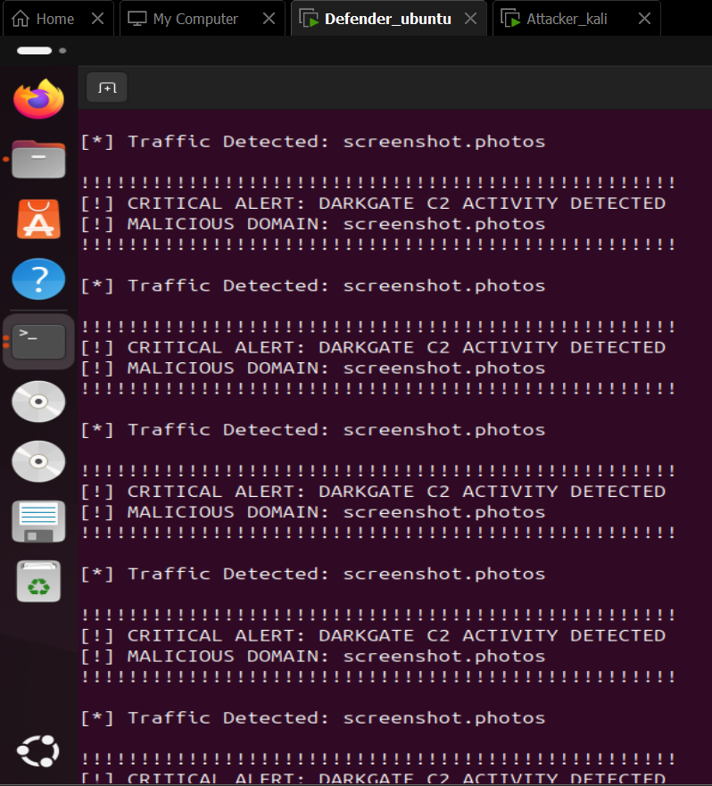

# Network Forensics Toolkit
**Automated Traffic Analysis & Malware Triage Suite**

## Project Overview
This toolkit is a collection of Python-based forensic tools designed to automate the manual "grunt work" of network investigations. Instead of manually filtering thousands of packets in Wireshark, these scripts provide instant insights into malicious activity.

---

##  Case Study: DarkGate Infection (Nov 2023)
The current module focuses on the **DarkGate Malware** infection chain. 

###  Featured Tool: DNS Analyzer
Located in `Scripts/dns_analyzer.py`, this tool extracts all unique DNS queries from a PCAP to identify Command & Control (C2) communication.

**Key Findings:**
- **Automated Extraction:** Successfully isolated 5 unique domains from the lab evidence.
- **Critical IoC Identified:** Identified communication with `Analysis_ouput.png`, a known DarkGate C2 domain.
- **Efficiency:** Reduced triage time from minutes to milliseconds.

---

##  Repository Structure
- ` Scripts/`: Core Python tools (Scapy-based).
- `Evidences/`: Lab PCAP files (Note: Excluded from Git for safety).
- `REPORT_LAB_01.md`: Detailed forensic breakdown of the DarkGate infection.

##  Getting Started
1. Clone the repo: `git clone https://github.com`
2. Install dependencies: `pip install scapy`
3. Run the analyzer: `python Scripts/dns_analyzer.py`

---

## Roadmap (May 2024)
- [x] Phase 1: DNS Triage & C2 Identification.
- [ ] Phase 2: HTTP Payload Extraction (Detecting malicious .zip/ .exe downloads).
- [ ] Phase 3: Memory Forensics Integration (Volatility 3 correlation).

## Live Simulation & Validation
To validate the toolkit, I simulated a "Detonation" in a controlled VMware environment.

### Results
- **Victim (Defender):** Ubuntu 24.04
- **C2 Node (Attacker):** Kali Linux
- **Finding:** Upon triggering a connection to `screenshot.photos`, the `dns_analyzer.py` tool instantly flagged the traffic.

> **Forensic Note:** The tool successfully identified the C2 heartbeat despite the malicious infrastructure being simulated as offline. This proves the tool's effectiveness in early-stage triage.
### Threat Intelligence Verification
To confirm the malicious nature of the identified IoC (`screenshot.photos`), I cross-referenced the domain with global threat feeds:

- **VirusTotal:** 50+ vendors flagged this domain as malicious.
- **Classification:** Categorized as **DarkGate Command & Control (C2)**.
- **Evidence:** [Threat_Intelligence Proof](Threat_Intelligence.png)

### New Feature: Persistent Forensic Logging
The toolkit now features a **CSV-based logging engine**. This ensures that all identified threats are preserved with full "Chain of Custody" details for later investigation.

- **Automated Logging:** Saves Timestamp, Source IP, Domain, and Severity to `network_evidence.csv`.
- **SIEM Ready:** The output format is compatible with professional tools like Splunk and Microsoft Sentinel.
- **Live Validation:** Tested in a VMware lab environment with real-time alerting.

